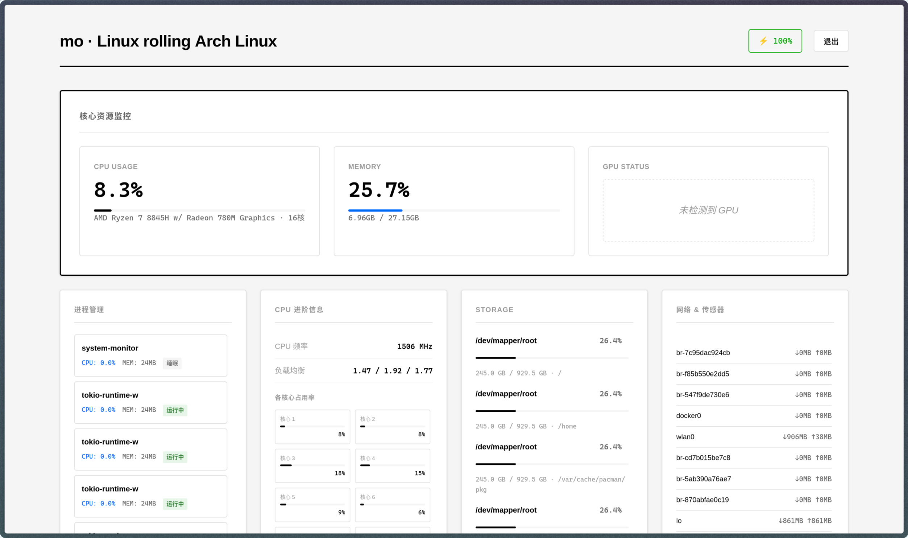
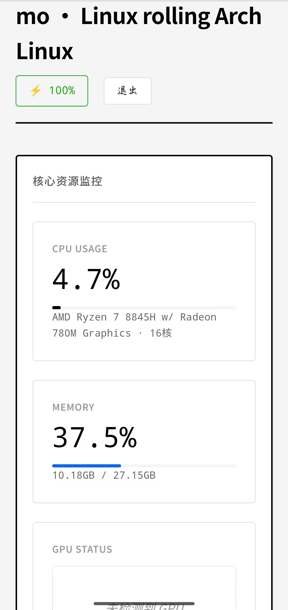
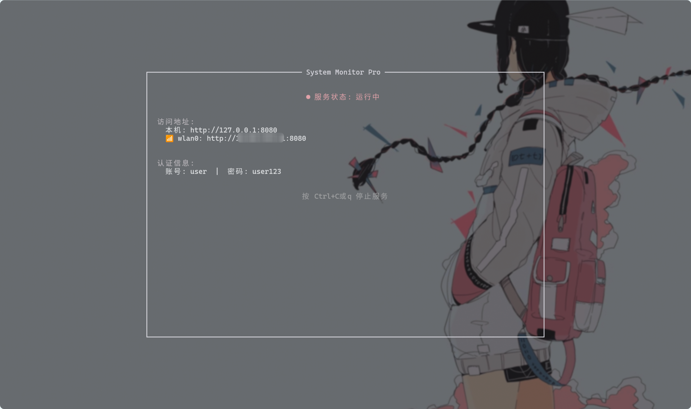

# System Monitor

一个现代化的跨平台系统监控工具，使用Rust构建后端，提供实时系统资源监控和可视化界面。

<div align="center">
  
  <br>
  
  <br>
  
</div>

## 功能特性

### 🚀 核心功能
- **实时监控**：实时显示CPU、内存、磁盘、网络等系统资源使用情况
- **多平台支持**：支持Linux、Windows、macOS等主流操作系统
- **Web界面**：现代化的响应式Web界面，支持移动端访问
- **终端界面**：同时提供TUI（终端用户界面）显示服务状态

### 🔧 监控项目
- **CPU监控**：整体使用率、每个核心使用率、频率、负载均衡
- **内存监控**：总内存、已用内存、使用百分比
- **GPU监控**：支持NVIDIA、AMD、Intel显卡，显示使用率、温度、显存等
- **磁盘监控**：各分区使用情况、剩余空间、挂载点
- **网络监控**：实时网速、各接口流量统计
- **进程管理**：显示运行中的进程，按CPU使用率排序
- **硬件传感器**：CPU温度、主板温度、风扇转速、电压等
- **电池监控**：笔记本电池状态、剩余电量、充电状态

### 🛡️ 安全特性
- **用户认证**：支持JWT令牌认证，保护监控数据安全
- **密码加密**：使用bcrypt进行密码哈希存储
- **CORS支持**：跨域资源共享配置
- **环境变量配置**：通过环境变量设置用户名密码

## 技术架构

### 后端技术栈
- **Rust**：高性能系统编程语言
- **Axum**：异步Web框架
- **Tokio**：异步运行时
- **sysinfo**：跨平台系统信息采集库
- **nvml-wrapper**：NVIDIA GPU监控
- **battery**：跨平台电池监控

### 前端技术栈
- **HTML5/CSS3**：现代化响应式界面
- **JavaScript**：实时数据更新和交互
- **模块化CSS**：分离的样式文件，便于维护

## 使用方式

### 启动服务
```bash
# 克隆项目
git clone <repository-url>
cd system-monitor

# 运行服务
cargo run
```

### 访问界面
服务启动后，可以通过以下方式访问：
1. **Web界面**：浏览器访问 `http://localhost:8080`
2. **终端界面**：启动时显示服务信息和访问地址
3. **API接口**：提供JSON格式的系统数据接口

### 环境变量配置
```bash
# 设置自定义用户名密码
export MONITOR_USER="your_username"
export MONITOR_PASS="your_password"
```

## 界面特点

### Web界面
- **响应式设计**：适配桌面端和移动端
- **实时更新**：自动刷新系统数据
- **可视化图表**：进度条显示资源使用情况
- **分类展示**：按功能模块分组显示信息

### 终端界面
- **简洁显示**：显示关键服务信息
- **访问提示**：显示Web界面访问地址
- **优雅退出**：支持Ctrl+C和q键退出

## 项目结构
```
system-monitor/
├── src/
│   ├── main.rs          # 主程序入口
│   ├── collector.rs     # 系统信息采集
│   ├── auth.rs          # 用户认证模块
│   ├── network.rs       # 网络功能
│   ├── static_files.rs  # 静态文件服务
│   ├── tui.rs           # 终端界面
│   └── static/          # Web前端文件
│       ├── index.html   # 主页面
│       ├── css/         # 样式文件
│       └── js/          # JavaScript文件
├── Cargo.toml          # Rust依赖配置
└── README.md           # 项目说明
```

## 适用场景
- **开发环境监控**：监控开发服务器的资源使用情况
- **生产环境监控**：轻量级的系统监控解决方案
- **个人电脑监控**：实时了解电脑运行状态
- **远程监控**：通过Web界面远程查看系统状态

## 优势特点
- **高性能**：Rust语言提供出色的性能和内存安全
- **低资源占用**：相比传统监控工具更加轻量
- **易于部署**：单文件可执行程序，无需复杂配置
- **开源免费**：完全开源，可自由修改和扩展

## 注意事项
- 首次运行需要安装Rust开发环境
- GPU监控功能需要相应的显卡驱动支持
- 部分硬件传感器数据可能因系统而异
- 建议在生产环境中使用环境变量配置认证信息

---

一个简单而强大的系统监控工具，帮助您实时了解系统运行状态。